# 🌐 Java Web Microframeworks
## Networking Fundamentals, HTTP Server & Lightweight REST Framework

[](https://www.java.com/)
[](https://maven.apache.org/)
[](LICENSE)

> **Enterprise Architecture (AREP)** — Laboratory 3  
> Building a lightweight web framework from scratch using Java networking primitives: TCP/UDP sockets, HTTP, RMI, and REST service registration via lambda expressions.

---

## 📋 **Table of Contents**

- [Overview](#-overview)
- [Project Structure](#-project-structure)
- [Architecture](#-architecture)
- [Modules and Features](#-modules-and-features)
- [Getting Started](#-getting-started)
- [Running the Applications](#-running-the-applications)
- [Acceptance Tests](#-acceptance-tests)
- [Author](#-author)
- [License](#-license)
- [Additional Resources](#-additional-resources)

---

## 🌍 **Overview**

This laboratory explores the foundational layers of internet communication and distributed systems in Java. Starting from raw **TCP/UDP socket programming**, it progressively builds toward a custom **MicroSpring web framework** capable of serving static files and handling REST endpoints defined through lambda expressions.

The project covers:

- ✨ **URL inspection** using `java.net.URL` accessor methods
- 🌐 **TCP socket communication** with echo, square, and trigonometric function servers
- 📡 **UDP datagram programming** with a resilient time-polling client
- 🔗 **Remote Method Invocation (RMI)** for distributed object communication
- 💬 **Bidirectional RMI chat** between peer nodes
- 🚀 **MicroSpring framework** — a custom lightweight HTTP server supporting REST routes and static file serving

---

## 📁 **Project Structure**

```
AREP-Lab-01-Java-Networks-Fundamentals/
├── .gitignore
├── LICENSE
├── pom.xml
├── README.md
├── assets/
│   ├── docs/
│   │   └── Web Microframeworks (AREP) [2026-02-24] - Luis Benavides (3 pg.).pdf
│   └── images/
│       ├── 01-project-compilation.png
│       ├── 02-url-info-methods.png
│       └── ... (19 total)
└── src/
    └── main/
        ├── java/edu/eci/arep/web/
        │   ├── app/
        │   │   └── AppDemo.java
        │   ├── client/
        │   │   ├── ChatNode.java
        │   │   ├── DatagramTimeClient.java
        │   │   ├── EchoClient.java
        │   │   ├── EchoServiceClient.java
        │   │   └── URLBrowser.java
        │   ├── framework/
        │   │   ├── MicroSpring.java
        │   │   ├── Request.java
        │   │   ├── Response.java
        │   │   └── RestService.java
        │   ├── server/
        │   │   ├── DatagramTimeServer.java
        │   │   ├── EchoServer.java
        │   │   ├── HttpServer.java
        │   │   ├── MathFunctionServer.java
        │   │   └── SquareServer.java
        │   ├── service/
        │   │   ├── ChatService.java
        │   │   ├── EchoService.java
        │   │   └── impl/
        │   │       ├── ChatServiceImpl.java
        │   │       └── EchoServiceImpl.java
        │   └── util/
        │       ├── URLInfo.java
        │       └── URLReader.java
        └── resources/
            ├── static/
            │   ├── index.html
            │   └── images/
            │       └── sample.png
            └── webroot/
                └── index.html
```

---

## 🏛️ **Architecture**

The project is organized into five distinct layers, each building upon the previous one:

| Layer | Package | Description |
|---|---|---|
| **Utilities** | `util` | URL inspection and raw content reading |
| **Servers** | `server` | TCP/UDP servers (echo, square, trig, HTTP, datagram) |
| **Clients** | `client` | TCP/UDP clients, RMI client, chat node |
| **Services** | `service` | RMI remote interfaces and implementations |
| **Framework** | `framework` + `app` | MicroSpring REST framework and demo application |

### MicroSpring Request Handling Flow

```
Browser/Client
     │
     ▼
MicroSpring (port 8080)
     │
     ├── /app/* path? ──► Route Map ──► RestService.handle(req, res) ──► JSON response
     │
     └── other path?  ──► Static File Resolution ──► target/classes/webroot/ ──► File response
                                                                │
                                                                └── Not found ──► 404 response
```

---

## 🔧 **Modules and Features**

### 1. 🔍 URL Utilities

`URLInfo` demonstrates the eight accessor methods of `java.net.URL`:

- `getProtocol()`, `getAuthority()`, `getHost()`, `getPort()`
- `getPath()`, `getQuery()`, `getFile()`, `getRef()`

`URLBrowser` fetches any URL entered by the user and saves the HTML body to `resultado.html`.

### 2. 🔌 TCP Servers

- **`EchoServer`** — reflects every message back prefixed with `"Response: "`. Terminates on `"Bye."`
- **`SquareServer`** — receives a number and responds with its square: $f(x) = x^2$
- **`MathFunctionServer`** — applies a trigonometric function (default: cosine) to incoming numbers. Supports runtime function switching via `fun:sin`, `fun:cos`, `fun:tan`

### 3. 🌐 HTTP Server

`HttpServer` listens on port `35000` and serves static files from `src/main/resources/static/`, supporting:

- HTML, CSS, JavaScript
- PNG, JPG/JPEG, GIF, ICO images
- Proper `Content-Type` headers and `404` responses

### 4. 📡 UDP Datagram Communication

`DatagramTimeServer` responds to any UDP packet with the current server time (`HH:mm:ss`).

`DatagramTimeClient` polls the server every **5 seconds**. If no response is received within the **3-second timeout**, the last known time is retained and displayed — the client **never crashes** while the server is offline and resumes updating automatically upon reconnection.

### 5. 🔗 RMI Echo Service

The `EchoService` interface defines a remote `echo(String)` contract. `EchoServiceImpl` exports the object and registers it in the RMI registry. `EchoServiceClient` looks up the service by name and invokes it remotely.

### 6. 💬 RMI Bidirectional Chat

`ChatNode` acts simultaneously as an RMI server and client. Each node:
- Registers a `ChatServiceImpl` in its **own local RMI registry**
- Connects to the **remote node's registry** to obtain a `ChatService` stub
- Sends messages through the stub while receiving messages via the local service implementation

### 7. 🚀 MicroSpring Framework

The core framework exposes three developer-facing APIs:

```java
// Register a REST GET route
MicroSpring.get("/hello", (req, res) -> "Hello " + req.getValues("name"));

// Register a route returning a computed value
MicroSpring.get("/pi", (req, res) -> String.valueOf(Math.PI));

// Set the static files base directory
MicroSpring.staticfiles("/webroot");

// Start the server on port 8080
MicroSpring.start();
```

`Request.getValues(String key)` parses query parameters from the URL automatically. `Response` exists as a placeholder parameter for future extensibility (YAGNI).

---

## 🚀 **Getting Started**

### Prerequisites

- **Java 17** or higher
- **Apache Maven 3.8** or higher
- **Git**

### Installation

```bash
# Clone the repository
git clone https://github.com/JAPV-X2612/AREP-laboratory-3-web-microframeworks
cd AREP-laboratory-3-web-microframeworks

# Compile the project
mvn compile
```

Expected output:

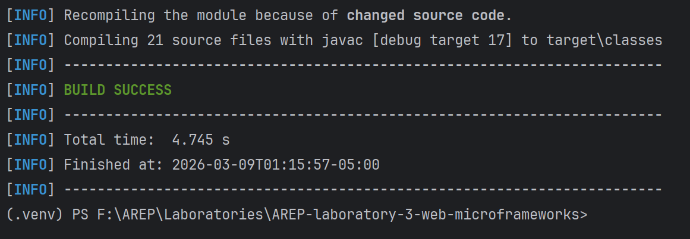

---

## ▶️ **Running the Applications**

### 🔍 URL Info

```bash
java -cp target/classes edu.eci.arep.web.util.URLInfo
```

### 🌐 URL Browser

```bash
java -cp target/classes edu.eci.arep.web.client.URLBrowser
# Enter: http://www.example.com
```

### 🔌 Echo Server & Client

**Terminal 1:**
```bash
java -cp target/classes edu.eci.arep.web.server.EchoServer
```

**Terminal 2:**
```bash
java -cp target/classes edu.eci.arep.web.client.EchoClient
```

### 📐 Square Server

**Terminal 1:**
```bash
java -cp target/classes edu.eci.arep.web.server.SquareServer
```

**Terminal 2:**
```bash
java -cp target/classes edu.eci.arep.web.client.EchoClient
```

### 📐 Math Function Server

**Terminal 1:**
```bash
java -cp target/classes edu.eci.arep.web.server.MathFunctionServer
```

**Terminal 2:**
```bash
java -cp target/classes edu.eci.arep.web.client.EchoClient
# Send: 0, 1.5708, fun:sin, 0, fun:tan, 0.7854
```

### 🌐 HTTP Server

```bash
java -cp target/classes edu.eci.arep.web.server.HttpServer
# Open: http://localhost:35000/index.html
```

### 📡 Datagram Time Server & Client

**Terminal 1:**
```bash
java -cp target/classes edu.eci.arep.web.server.DatagramTimeServer
```

**Terminal 2:**
```bash
java -cp target/classes edu.eci.arep.web.client.DatagramTimeClient
```

### 🔗 RMI Echo Service

**Terminal 1 — RMI Registry (from `target/classes`):**
```bash
cd target/classes
rmiregistry 23000
```

**Terminal 2 — Server:**
```bash
java -cp target/classes edu.eci.arep.web.service.impl.EchoServiceImpl
```

**Terminal 3 — Client:**
```bash
java -cp target/classes edu.eci.arep.web.client.EchoServiceClient
```

### 💬 RMI Chat

> Start **Node B first**, then Node A.

**Terminal 1 — Node B:**
```bash
java -cp target/classes edu.eci.arep.web.client.ChatNode
# local port: 23002 | remote: 127.0.0.1 | remote port: 23001 | name: Bob
```

**Terminal 2 — Node A:**
```bash
java -cp target/classes edu.eci.arep.web.client.ChatNode
# local port: 23001 | remote: 127.0.0.1 | remote port: 23002 | name: Alice
```

### 🚀 MicroSpring Framework Demo

```bash
java -cp target/classes edu.eci.arep.web.app.AppDemo
```

Then open:
- `http://localhost:8080/index.html`
- `http://localhost:8080/app/hello?name=Pedro`
- `http://localhost:8080/app/pi`

---

## 🧪 **Acceptance Tests**

### 1. Project Compilation


---

### 2. URL Info — 8 Accessor Methods

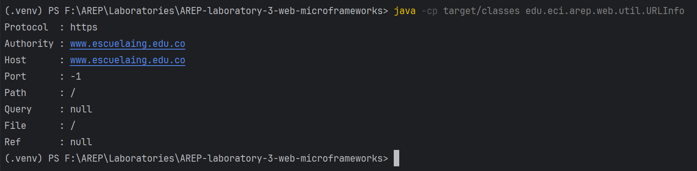

---

### 3. URL Browser — HTML Saved to File

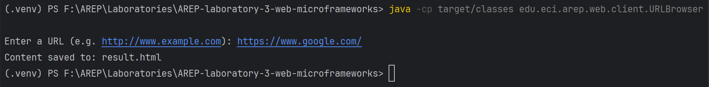

---

### 4. URL Browser — Result Opened in Browser

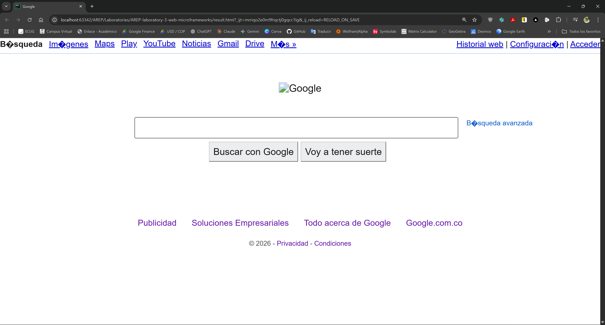

---

### 5. Square Server — Computing $f(x) = x^2$

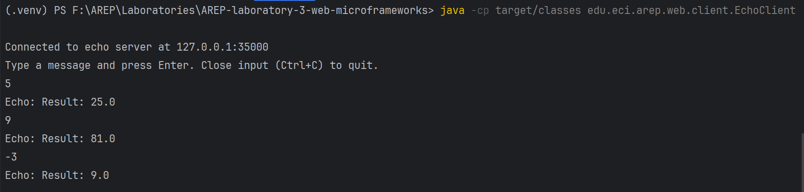

---

### 6. Math Function Server — Trigonometric Functions

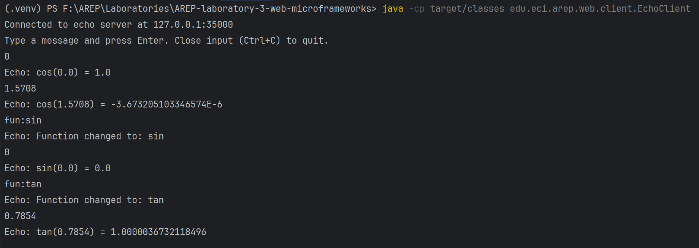

---

### 7. HTTP Server — Serving `index.html`

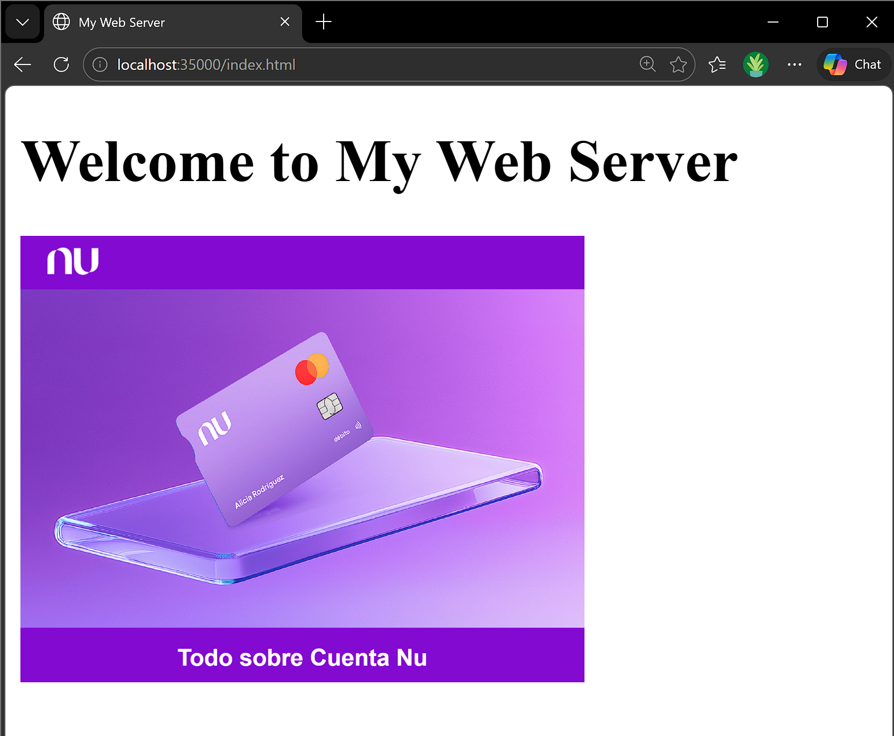

---

### 8. HTTP Server — Serving an Image


---

### 9. HTTP Server — 404 Not Found

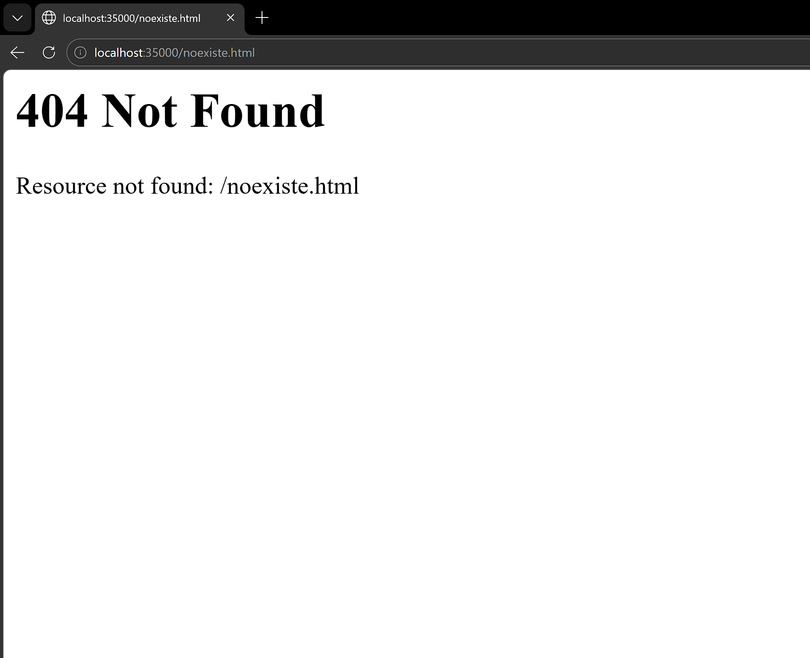

---

### 10. Datagram Time Client — Live Updates

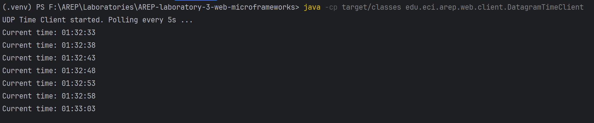

---

### 11. Datagram Client — Retaining Last Known Time (Server Offline)

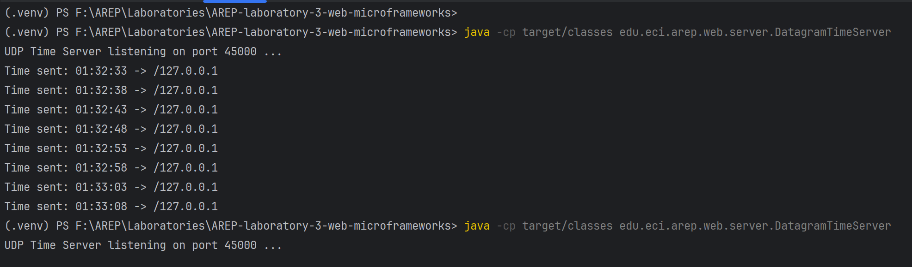

---

### 12. Datagram Client — Reconnection After Server Restart

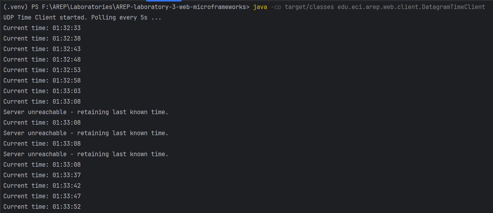

---

### 13. Echo Server & Client — Full Session

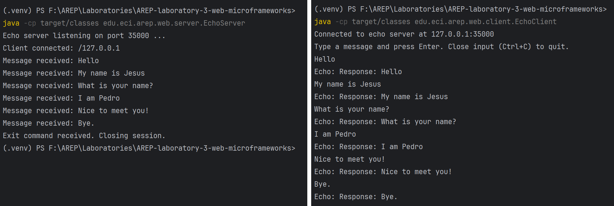

---

### 14. RMI Echo Service — Remote Method Invocation

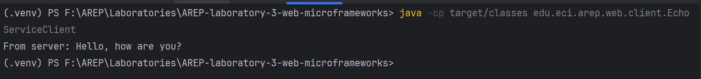

---

### 15. RMI Chat — Bidirectional Communication

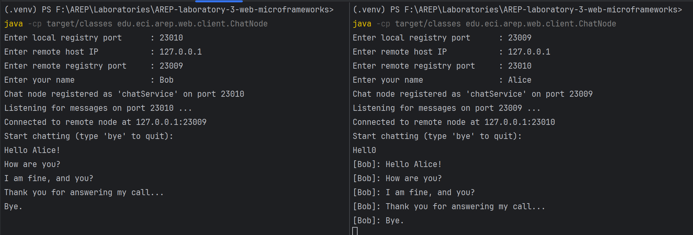

---

### 16. MicroSpring — Serving `index.html`

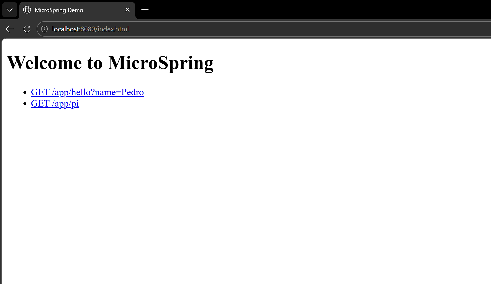

---

### 17. MicroSpring — `/app/hello?name=Pedro`

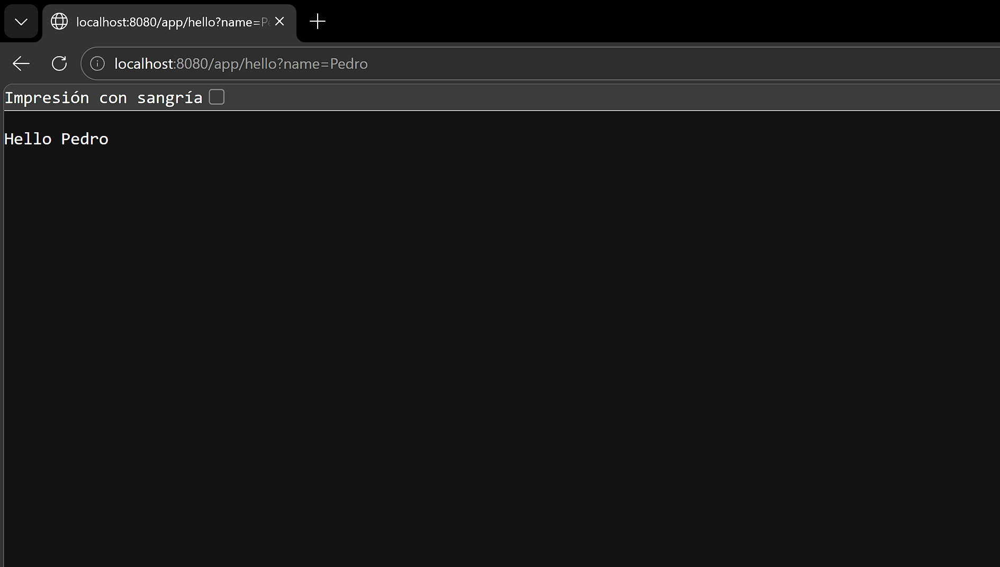

---

### 18. MicroSpring — `/app/pi`

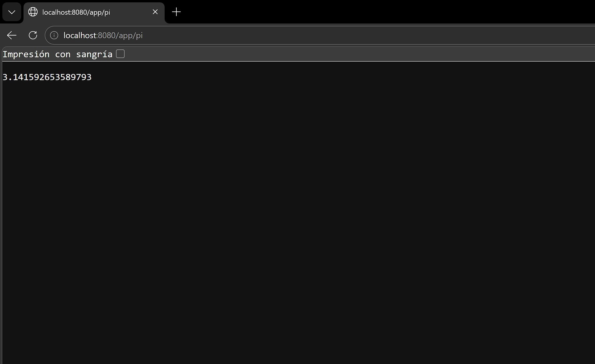

---

### 19. MicroSpring — 404 Not Found

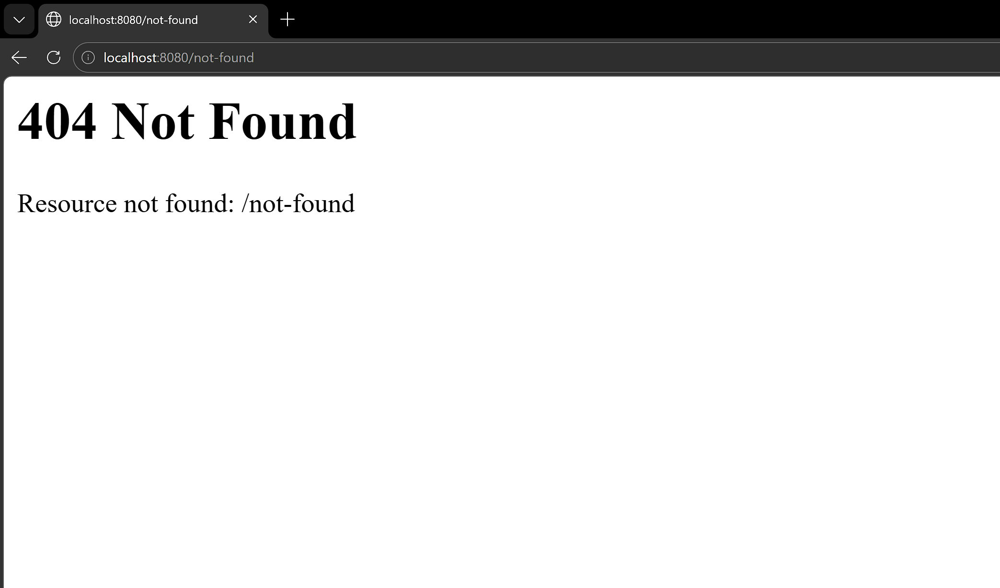

---

## 👥 **Author**

<table>
  <tr>
    <td align="center">
      <a href="https://github.com/JAPV-X2612">
        
        <br />
        <sub><b>Jesús Alfonso Pinzón Vega</b></sub>
      </a>
      <br />
      <sub>Full Stack Developer</sub>
    </td>
  </tr>
</table>

---

## 📄 **License**

This project is licensed under the **Apache License, Version 2.0** — see the [LICENSE](LICENSE) file for details.

---

## 🔗 **Additional Resources**

### Java Networking
- [Java Networking Tutorial — Oracle](https://docs.oracle.com/javase/tutorial/networking/index.html)
- [java.net Package Documentation](https://docs.oracle.com/en/java/docs/api/java.base/java/net/package-summary.html)
- [Java RMI Guide](https://docs.oracle.com/javase/tutorial/rmi/index.html)

### Protocols and Standards
- [HTTP/1.1 Specification — RFC 7230](https://datatracker.ietf.org/doc/html/rfc7230)
- [TCP vs UDP — Cloudflare](https://www.cloudflare.com/learning/ddos/glossary/tcp-vs-udp/)
- [MIME Types Reference — MDN](https://developer.mozilla.org/en-US/docs/Web/HTTP/Basics_of_HTTP/MIME_types)

### Architecture and Design
- [SOLID Principles](https://www.digitalocean.com/community/conceptual-articles/s-o-l-i-d-the-first-five-principles-of-object-oriented-design)
- [REST Architectural Style — Roy Fielding](https://www.ics.uci.edu/~fielding/pubs/dissertation/rest_arch_style.htm)
- [Principles of Computer System Design — Saltzer & Kaashoek](https://ocw.mit.edu/resources/res-6-004-principles-of-computer-system-design-an-introduction-spring-2009/)

### Build Tools
- [Apache Maven Documentation](https://maven.apache.org/guides/index.html)
- [Maven Standard Directory Layout](https://maven.apache.org/guides/introduction/introduction-to-the-standard-directory-layout.html)

---

⭐ *If you found this project helpful, please consider giving it a star!* ⭐
